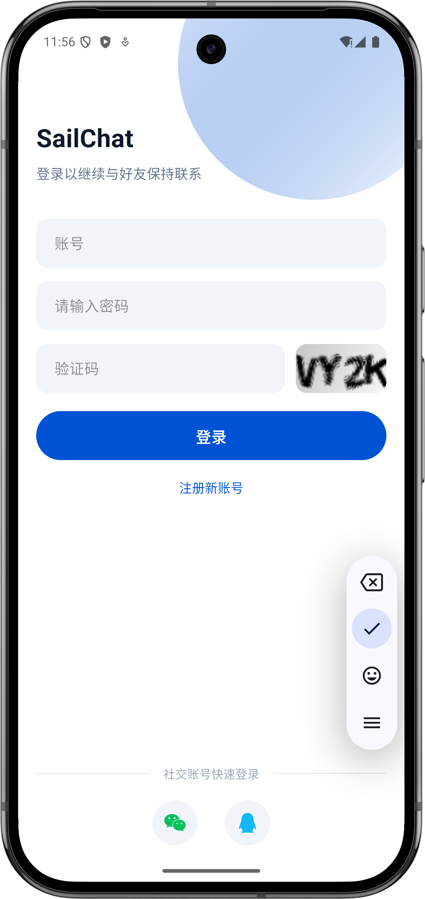
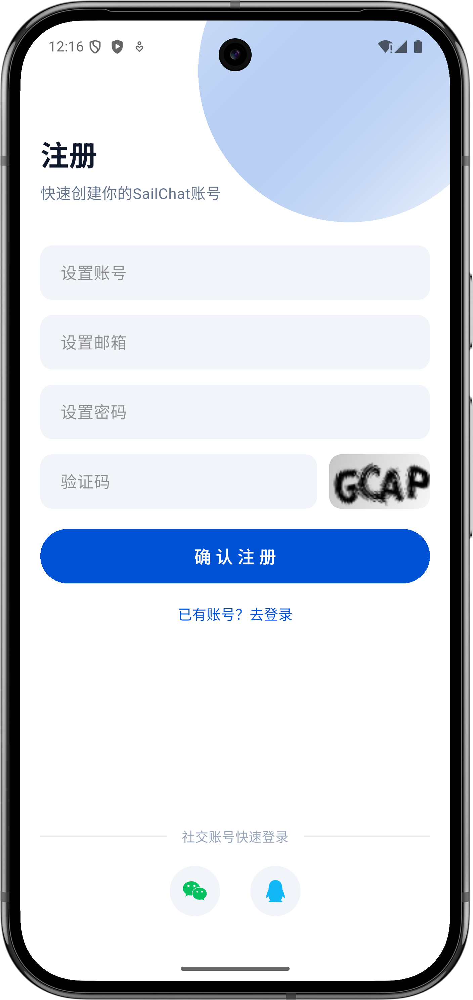
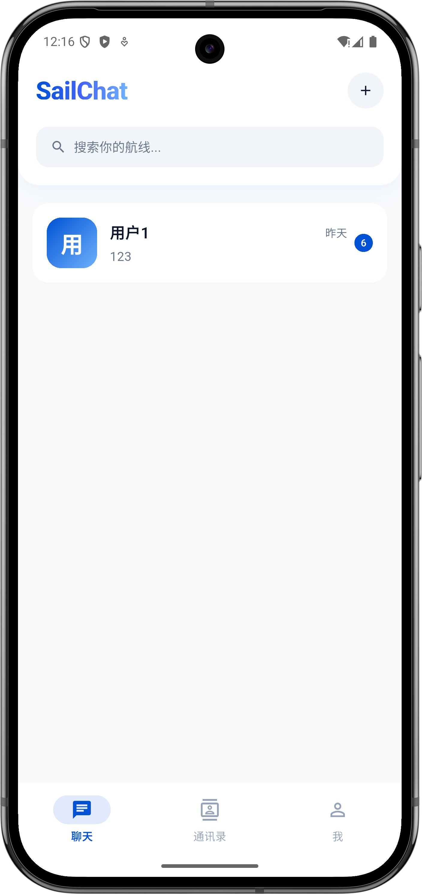
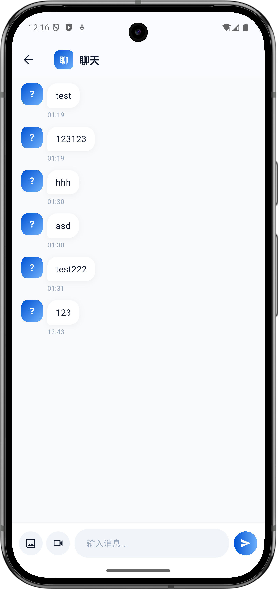
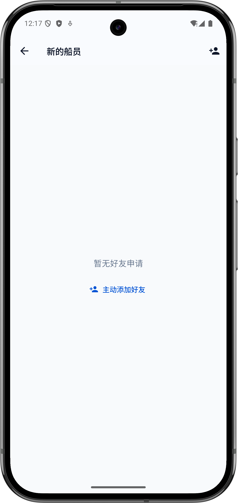
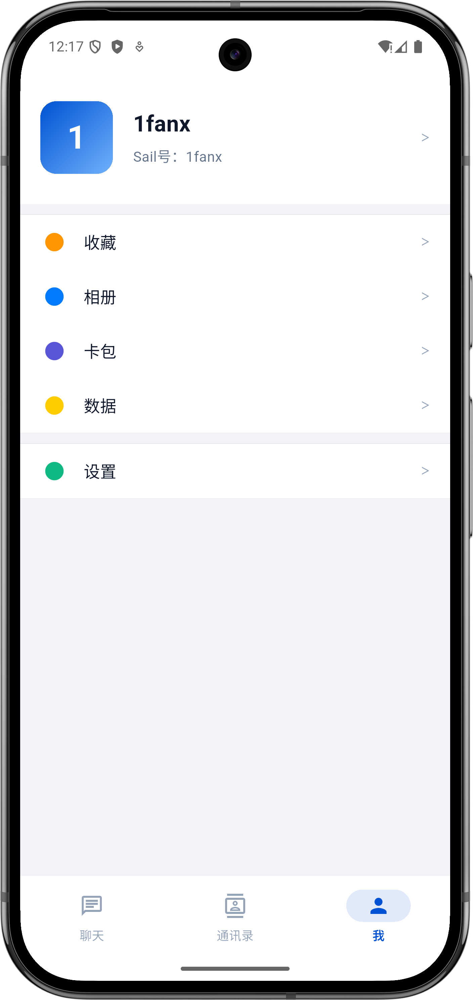
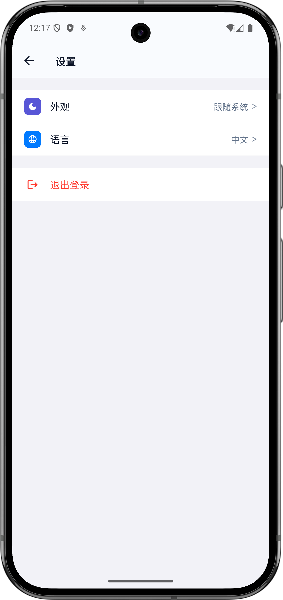
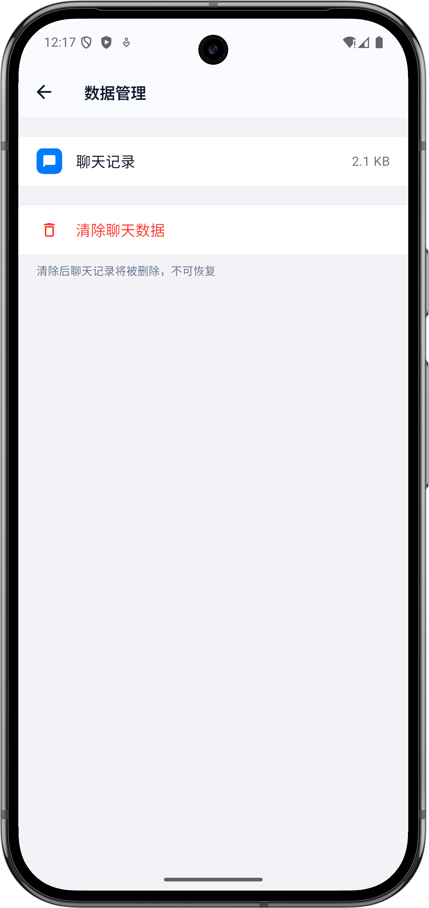

<div align="center">

# SailChat

基于 Flutter 的跨平台即时通讯应用，采用 WebSocket 实时通信 + 本地消息缓存 + 清晰分层架构。

[](https://flutter.dev)
[](https://dart.dev)

后端 Spring Boot：[SailChat-Server](https://github.com/XieYifan1201/SailChat-Server)

</div>

---

## 截图

| 登录 | 注册 | 会话列表 |
|:----:|:----:|:-------:|
|  |  |  |

| 聊天室 | 添加好友 | 通讯录 |
|:-----:|:-------:|:-----:|
|  |  |  |

| 我的 | 设置 | 数据管理 |
|:---:|:---:|:------:|
|  |  |  |

## 功能特性

- **实时通讯** — 基于 WebSocket 的即时消息收发，支持断线自动重连与在线状态感知
- **消息持久化** — 本地 SharedPreferences 缓存，退出不丢失，重进自动同步未读
- **多媒体消息** — 支持图片和视频发送，先上传文件再通过 WebSocket 发送 URL
- **好友管理** — 按用户名搜索、发送/接受/拒绝好友申请，实时通知
- **会话列表** — 按最新消息排序，显示未读数和昵称
- **JWT 鉴权** — Token 存 FlutterSecureStorage，路由守卫自动拦截未登录
- **深色模式** — 完整的亮色/暗色主题，基于 ThemeExtension 自定义色板
- **国际化** — 中文简繁体 + 英文，.arb 文件生成，默认中文
- **缓存优先** — 先展示本地缓存，再拉接口刷新，弱网也能用

## 项目架构

```
lib/
├── main.dart                          # 入口，ProviderScope 包一层
├── router/
│   └── app_router.dart                # GoRouter 路由配置 + 登录态拦截
├── models/                            # 数据模型，JSON 序列化
│   ├── message.dart                   # 聊天消息模型，含消息状态和类型
│   ├── conversation.dart              # 会话模型，解析 targetUser 信息
│   ├── friend.dart                    # 好友关系模型，含好友用户信息
│   ├── friend_request.dart            # 好友申请模型，含 UserBrief
│   ├── user.dart                      # 用户模型，含头像昵称等资料
│   └── system_notification.dart       # 系统通知模型，好友申请/同意/拒绝
├── services/                          # 网络层（Dio + 拦截器）
│   ├── http_client.dart               # 全局 Dio 实例，鉴权拦截 + 白名单
│   ├── user_service.dart              # 用户接口：登录注册、个人信息、搜索
│   ├── message_service.dart           # 消息接口：发消息、历史记录、上传文件
│   └── friend_service.dart            # 好友接口：列表、申请、同意/拒绝
├── socket/
│   └── chat_websocket.dart            # WebSocket 封装，stream 分发消息和通知
├── store/                             # 状态管理（Riverpod）
│   ├── auth_provider.dart             # 登录态 & Token 生命周期
│   ├── user_provider.dart             # 当前用户信息
│   ├── chat_history_provider.dart     # 每个会话一个 StateNotifier
│   ├── message_notifier.dart          # 消息收发/已读标记中枢
│   ├── conversation_provider.dart     # 会话列表，缓存优先加载
│   ├── friend_provider.dart           # 好友列表 & 好友申请列表
│   ├── target_user_provider.dart      # 跨数据源查用户信息
│   ├── ws_provider.dart               # WebSocket stream → Riverpod 桥接
│   ├── settings_provider.dart         # 主题/语言持久化
│   ├── message_provider.dart          # 消息相关 provider 统一导出
│   └── riverpod.dart                  # 服务层 provider 导出
├── utils/
│   ├── app_colors.dart                # ThemeExtension 自定义色板
│   ├── app_theme.dart                 # 亮色/暗色 ThemeData
│   ├── cache_storage.dart             # SharedPreferences 本地缓存
│   ├── token.dart                     # 安全 Token 存储（FlutterSecureStorage）
│   ├── user_storage.dart              # 用户信息缓存
│   ├── user_avatar.dart               # 头像组件，无图时显示首字母
│   └── l10n.dart                      # 国际化辅助类
├── pages/                             # 页面
│   ├── login_page.dart                # 登录注册页
│   ├── main_layout.dart               # 底部导航壳
│   ├── chats_page.dart                # 会话列表
│   ├── chat_page.dart                 # 聊天室（支持多媒体）
│   ├── contacts_page.dart             # 通讯录
│   ├── mine_page.dart                 # 我的
│   ├── add_friend_page.dart           # 添加好友页
│   ├── friend_requests_page.dart      # 好友申请列表页
│   ├── friend_detail_page.dart        # 好友详情页
│   ├── profile_page.dart              # 编辑个人资料页
│   ├── settings_page.dart             # 设置页
│   └── data_page.dart                 # 缓存管理页
└── l10n/                              # 国际化源文件 + 生成代码
    ├── app_zh.arb                     # 中文简体翻译
    ├── app_zh_TW.arb                  # 中文繁体翻译
    └── app_en.arb                     # 英文翻译
```

## 技术栈

| 分类 | 技术 | 用途 |
|------|------|------|
| 框架 | Flutter 3.29+ | 跨平台 UI |
| 语言 | Dart 3.11+ | 空安全、模式匹配 |
| 状态管理 | flutter_riverpod | StateNotifier + FutureProvider 响应式状态 |
| 路由 | go_router | 声明式路由，StatefulShellRoute 保 tab 状态 |
| 网络请求 | Dio | REST API + 拦截器 |
| 实时通信 | web_socket_channel | WebSocket 收发消息 |
| 本地存储 | SharedPreferences | 消息和列表缓存 |
| 安全存储 | flutter_secure_storage | Token 持久化 |
| 图片加载 | cached_network_image | 网络图缓存 + 占位 |
| 媒体选择 | image_picker | 选图/选视频 |
| 图标 | flutter_svg | SVG 渲染 |
| 国际化 | flutter_localizations | ARB 代码生成 |

## 核心设计

### 为什么聊天记录用 StateNotifier 而不是 FutureProvider

聊天记录用 `StateNotifierProvider.family`，发消息/收消息时直接 `addMessage` 追加到状态里。如果用 FutureProvider，每次 `invalidate` 会先进入 `AsyncLoading`，列表闪一下再重新加载，体验很差。

### 缓存优先策略

所有列表 provider 都遵循同一套流程：
1. 先读本地缓存 → 立刻展示
2. 再拉接口 → 合并缓存 → 更新状态
3. 接口挂了 → 用缓存顶着

弱网环境下也能保证页面有内容。

### 跨数据源用户信息解析

用户昵称和头像从多个来源按优先级取：
`会话.targetUser.nickname` → `好友列表.friendUser.nickname` → `username` → 兜底

因为会话接口不一定返回完整的用户信息，需要结合好友列表补全。

### WebSocket → Riverpod 桥接

WebSocket 事件转成 Riverpod `StreamProvider`，UI 层通过标准的 `ref.watch` 响应消息和通知，不用手动管理监听生命周期。

## 快速开始

### 环境要求

- Flutter SDK 3.29+（Dart 3.11+）
- 后端服务已启动（默认地址：`http://10.0.2.2:8080`）

### 安装运行

```bash
# 克隆仓库
git clone https://github.com/<your-username>/sail_chat.git
cd sail_chat

# 安装依赖
flutter pub get

# 生成国际化文件
flutter gen-l10n

# 运行
flutter run
```

### 后端地址配置

两个地方需要改：

- **REST API**：`lib/services/http_client.dart` 里的 `baseUrl`
- **WebSocket**：`lib/store/ws_provider.dart` 里 `ChatWebSocket` 的构造参数

Android 模拟器用 `10.0.2.2` 访问宿主机 localhost，iOS 模拟器直接用 `localhost`。

## 代码约定

### Service 层

Service 只负责调接口，返回 `Map<String, dynamic>` 或 `List<Map<String, dynamic>>`。模型转换（`fromJson`）在 store 层做，保持 Service 轻量可测试。

### Provider 组织

```
store/
├── riverpod.dart              # 服务 provider 导出（barrel）
├── message_provider.dart      # 消息相关 provider 统一导出
├── *_provider.dart            # 各功能独立 provider
```

每个功能一个文件，`message_provider.dart` 作为便捷导出，消费方只需一个 import。

### 错误处理

- API 错误在 provider 层捕获，有缓存就用缓存
- 401 自动清 Token，路由守卫跳登录页
- 接口挂了有缓存就不报错，没缓存才展示错误态
